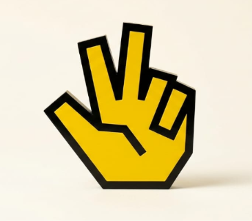

<div align="center">



# 🖐️ Gesture Studio

### Play In-Browser Games Using Only Your Hands & Webcam

A futuristic browser gaming arcade and interactive gesture platform powered by **MediaPipe Computer Vision**, **React 19**, **HTML5 Canvas**, and **Firebase**. Control games naturally through thin air with real-time hand tracking — zero gamepads, consoles, or touchscreens required.

[](https://gesturestudio.vercel.app/)
[](https://github.com/Lalith-srinivas/Gesture-Studio)

<br />


-FFCA28?logo=firebase&logoColor=black)


</div>

---

## ⚡ What is Gesture Studio?

**Gesture Studio** transforms any standard webcam into a high-precision spatial gaming controller. By executing cutting-edge AI hand landmark detection client-side, players can swipe, pinch, point, and aim in mid-air to play full-featured arcade games with zero hardware installations and complete privacy.

### Key Highlights
- 🧠 **100% Client-Side Privacy**: Camera feeds are processed strictly in your browser via WebAssembly; no video is ever uploaded or stored.
- ⚡ **Ultra-Low Latency**: Sub-16ms landmark detection pipeline with smooth coordinate interpolation and multi-resolution mapping.
- 🎨 **Neo-Brutalist Aesthetic**: High-contrast, vibrant arcade design with bold typography, hard borders, and playful retro styling.
- ☁️ **Cross-Device Progression**: Powered by Firebase Authentication and Cloud Firestore for synchronized XP, levels, daily streaks, and live leaderboards.
- 🎓 **Interactive Gesture Academy**: Learn hand controls step-by-step with interactive visual feedback before jumping into games.

---

## 🎮 Arcade Games

| Game | Mode | Signature Gesture | Description |
| :--- | :--- | :--- | :--- |
| 🍉 **Fruit Ninja** | Arcade Slice | ☝️ **Index Swipe** | Slice airborne fruits with glowing blade trails. Avoid bombs and chain combos for slow-motion frenzy! |
| 🏎️ **Crazy Road** | Traffic Racer | ☝️/✋/🤟 **Fingers** & ✊ **Fist** | Navigate 3 dense traffic lanes using finger poses and clench your fist to trigger high-octane nitro boost! |
| 🐦 **Flappy Bird** | Arcade Fly | 🤏 **Pinch** | Pinch thumb and index to flap wings and navigate tight pipe gaps with pixel-perfect hitboxes. |
| 🏹 **Archery Challenge** | Target Range | 🤏 **Pinch & Draw** | Pinch to notch an arrow, pull back to build bow tension, and release to hit moving bullseyes with wind physics. |
| 🦅 **Bird Hunter** | Slingshot Physics | 🤏 **Pinch & Pull** | Slingshot rocks, tennis balls, and energy orbs with 2D trajectory physics to hunt elusive birds in flight. |
| 🚀 **Space Shooter** | Galactic Arcade | ☝️ **Steer** & 🤏 **Pinch EMP** | Pilot a starship across endless cosmic waves, fire plasma bursts, and trigger EMP shockwaves by pinching. |

---

## 🎓 Gesture Academy

Before diving into games, players can complete the **Gesture Academy** — a 7-step interactive certification training curriculum that teaches:
1. ☝️ **Index Point**: Precision targeting and hover slicing
2. ✌️ **Peace Sign**: Secondary lane switching & gestures
3. 🤟 **Rock Sign**: Utility triggers & pause toggles
4. 🤏 **Pinch**: Grabbing, slingshot pullbacks, bow tension, and flapping
5. ✋ **Open Palm**: Brake, pause, and area shielding
6. ✊ **Closed Fist**: Nitro boost charging & shot cancellation
7. 👈 / 👉 **Directional Swipes**: Agile horizontal maneuvering

---

## 🖐️ Universal Gesture Cheat Sheet

```
   ☝️ Index Point       ✌️ Peace Sign         🤏 Pinch           ✊ Closed Fist        ✋ Open Palm
   [Aim / Slice]       [Lane 2 Switch]     [Grab / Shoot]     [Boost / Charge]      [Pause / Shield]
```

*Note: All games feature automatic mouse, keyboard, and touch fallbacks for full accessibility on any device.*

---

## 🏆 Progression & Social Features

- 👤 **Unified Auth System**: Sign in with Google, Email/Password, or start immediately as a **Guest** without losing your progress.
- 🎖️ **XP & Leveling System**: Earn XP after every match, level up from **Rookie (Level 1)** to **Grandmaster (Level 50)**, and track streak bonuses.
- 🥇 **Achievement System**: Unlock 20+ milestone badges for slicing streaks, survival times, and perfect accuracy.
- 🏆 **Live Global & Per-Game Leaderboards**: Real-time Firestore rank tracking across all players with multi-device high-score synchronization.
- 🎁 **Daily Login Rewards**: 7-day progressive reward calendar to maintain your active gaming streak.
- 📢 **Ad-Ready Architecture**: Built-in, non-intrusive ad slot abstraction (`AdSlot`, `AdContext`, `RewardedAdModal`) supporting future Google AdSense and HTML5 Game Ads with zero Cumulative Layout Shift (CLS).

---

## 🛠️ Tech Stack

### Frontend & UI
- **Framework**: [React 19](https://react.dev/) + [Vite](https://vitejs.dev/)
- **Routing**: [React Router v7](https://reactrouter.com/)
- **Styling**: [Tailwind CSS](https://tailwindcss.com/) (Neo-Brutalism design system)
- **Icons & Graphics**: Custom SVG set + HTML5 2D Canvas

### Computer Vision & Physics
- **Hand Tracking**: [Google MediaPipe Hands](https://developers.google.com/mediapipe/solutions/vision/hand_landmarker) (`@mediapipe/hands`, `@mediapipe/camera_utils`)
- **Physics Engine**: [Matter.js](https://brm.io/matter-js/) (rigid body dynamics for projectiles & gravity)

### Backend & Cloud Services
- **Authentication**: [Firebase Auth](https://firebase.google.com/docs/auth) (Google OAuth & Anonymous Guests)
- **Database**: [Cloud Firestore](https://firebase.google.com/docs/firestore) (Optimistic client caching, real-time leaderboard listeners)
- **Deployment**: [Vercel](https://vercel.com)

---

## 📁 Project Structure

```text
Gesture-Studio/
├── public/                     # Static assets, logos, favicon & SEO
│   ├── gesturestudio.png       # Official Gesture Studio logo & icon
│   ├── sitemap.xml             # Search engine XML sitemap
│   └── robots.txt              # Web crawler instructions
├── src/
│   ├── components/             # Reusable UI & progression components
│   │   ├── ads/                # AdSlot, RewardedAdModal (Ad-Ready Layer)
│   │   ├── GestureCursor.jsx   # In-browser air cursor for navigation
│   │   ├── HolographicHand.jsx # AR holographic hand visualizer
│   │   ├── PostGameProgression.jsx # Post-match XP & achievement summary
│   │   └── WelcomeModal.jsx    # Guest vs. Sign-in onboarding flow
│   ├── context/                # Global React contexts
│   │   ├── AuthContext.jsx     # Firebase auth & identity sync
│   │   ├── PlayerContext.jsx   # XP, Level, Streaks, & Stats engine
│   │   └── AdContext.jsx       # Non-intrusive ad & rewarded flow controller
│   ├── hooks/                  # Custom React hooks
│   │   ├── useHandTracking.js  # MediaPipe webcam pipeline & coordinate smoothing
│   │   ├── useLeaderboard.js   # Real-time Firestore leaderboard listener
│   │   └── usePlayer.js        # Progression & player profile consumer
│   ├── pages/                  # Application views & games
│   │   ├── Home.jsx            # Main arcade hub & game selector
│   │   ├── GestureAcademy.jsx  # Interactive 7-lesson gesture training
│   │   ├── FruitNinja.jsx      # Fruit slicing arcade game
│   │   ├── crazyroad.jsx       # Traffic racer game
│   │   ├── FlappyBird.jsx      # Gesture flappy bird game
│   │   ├── ArcheryChallenge.jsx# Bow & arrow target game
│   │   ├── BirdHunterChallenge.jsx # Slingshot physics bird game
│   │   ├── SpaceShooter.jsx    # Void galactic shooter
│   │   ├── LeaderboardPage.jsx # Global & per-game rankings
│   │   ├── AchievementsPage.jsx# Badge trophy case
│   │   └── ProfilePage.jsx     # Player stats, streak, avatar picker
│   └── utils/                  # Coordinate mapping, sound synthesis, gesture detectors
├── index.html                  # HTML entry point with MediaPipe CDNs
└── package.json                # Dependencies & build scripts
```

---

## 🚀 Getting Started

### Prerequisites
- [Node.js](https://nodejs.org/) (v18 or higher recommended)
- A working webcam connected to your computer
- A modern Chromium-based browser (Chrome, Edge, Brave) or Firefox / Safari with WebRTC camera permissions enabled

### Installation

1. **Clone the repository:**
   ```bash
   git clone https://github.com/Lalith-srinivas/Gesture-Studio.git
   cd Gesture-Studio
   ```

2. **Install dependencies:**
   ```bash
   npm install
   ```

3. **Start the local development server:**
   ```bash
   npm run dev
   ```
   Open [http://localhost:5173](http://localhost:5173) in your browser.

4. **Build for production:**
   ```bash
   npm run build
   ```

5. **Preview production build:**
   ```bash
   npm run preview
   ```

---

## 🔒 Privacy & Camera Permissions

Gesture Studio takes user privacy seriously:
- **Zero Video Uploads**: Video stream processing happens entirely inside your device's memory using WebAssembly.
- **No Video Recording**: The webcam stream is strictly analyzed in real time frame-by-frame and immediately discarded.
- **Camera Indicators**: Your browser will always display the hardware camera indicator when hand tracking is active.

---

## 🤝 Contributing

Contributions, feature suggestions, and bug reports are warmly welcome!
1. Fork the Project
2. Create your Feature Branch (`git checkout -b feature/AmazingGame`)
3. Commit your Changes (`git commit -m 'Add some AmazingGame'`)
4. Push to the Branch (`git push origin feature/AmazingGame`)
5. Open a Pull Request

---

## 📄 License

This project is open source and available under the [MIT License](LICENSE).

---

<div align="center">

**Built with ❤️ by [Lalith Srinivas](https://github.com/Lalith-srinivas)**

*Gesture Studio — Play with Your Hands, Rule the Arcade.*

</div>